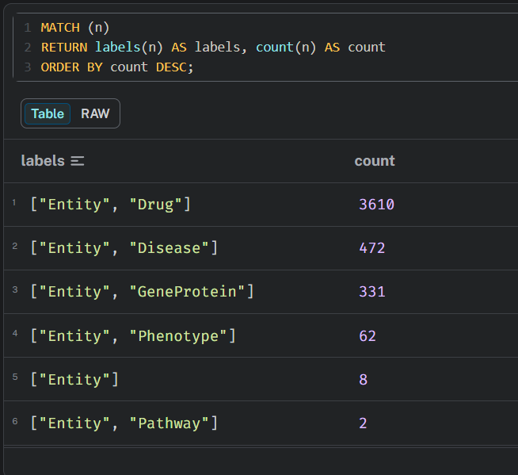
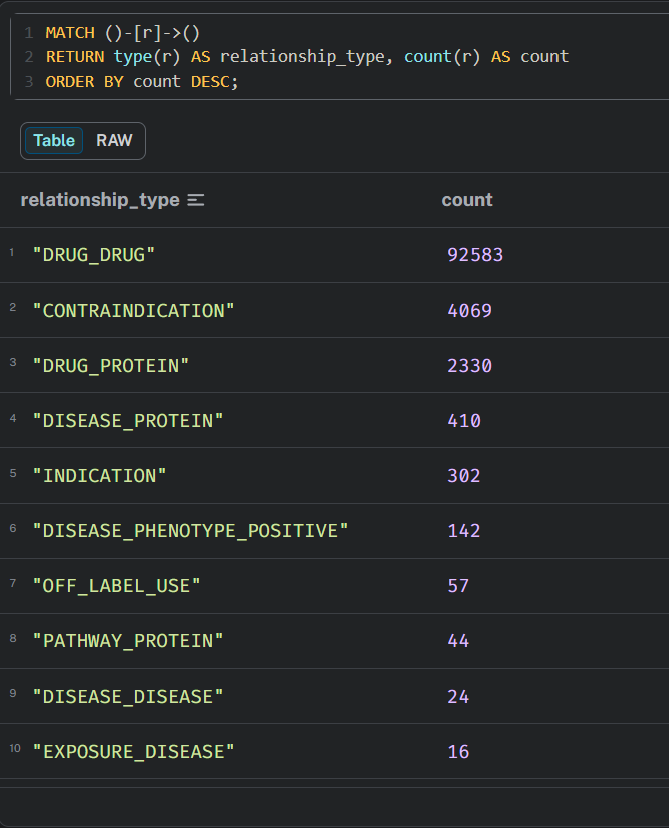
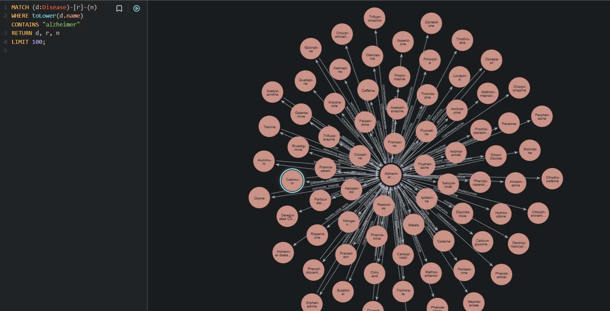
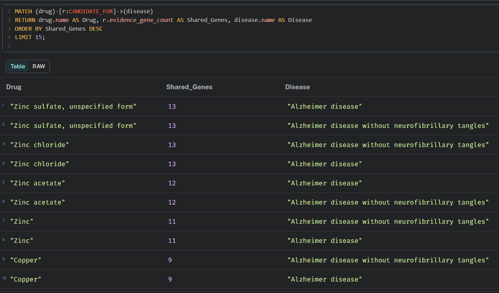
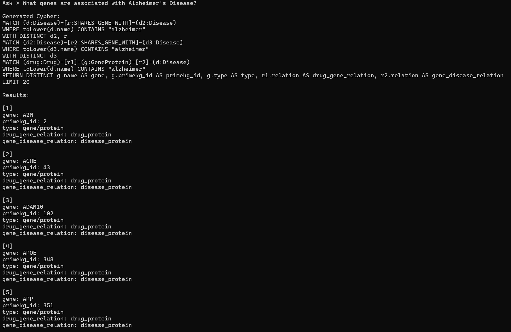

# PrimeKG Neo4j Biomedical QA

A prototype natural language question-answering system built on a Neo4j knowledge graph using the PrimeKG biomedical dataset and Azure OpenAI.

This project translates natural language questions into read-only Cypher queries, executes them against a local Neo4j database, and returns the results. It includes symbolic rule derivation to create secondary biomedical hypotheses (such as drug repurposing candidates and pathway involvements) for improved reasoning and explainability.

## Key Features

- **Natural Language to Cypher:** Translates complex biomedical queries into valid Neo4j Cypher queries using Azure OpenAI.
- **Symbolic Rule Derivation:** Utilizes Cypher to infer and construct new biomedical hypotheses (e.g., `CANDIDATE_FOR` drug treatments) based on multi-hop graph patterns.
- **Explainable AI:** Explains derived relationships by retaining and exposing the underlying genetic or phenotypic evidence directly within the graph.
- **Security Validations:** Enforces read-only query execution (`MATCH`, `RETURN`) by actively blocking unsafe operations (`CREATE`, `DELETE`, `APOC`, etc.).

---

## Setup Instructions

### 1. Database Configuration
Ensure your Neo4j database is running and populate your `.env` file with your credentials:
```env
NEO4J_URI=bolt://127.0.0.1:7687
NEO4J_USER=neo4j
NEO4J_PASSWORD=your_password

AZURE_OPENAI_API_KEY=your_key
AZURE_OPENAI_ENDPOINT=https://your-endpoint.cognitiveservices.azure.com/
AZURE_OPENAI_DEPLOYMENT=your_deployment
AZURE_OPENAI_API_VERSION=2025-04-01-preview
```

### 2. Data Ingestion
Install dependencies and run the ingestion script to populate the local Neo4j database with the PrimeKG subset:
```bash
python injest_primekg_subset.py
```

### 3. Rule Derivations
Execute `rules_primekg.cypher` in the Neo4j Browser to generate derived relationships, such as candidate drug treatments based on shared genetic evidence.

---

## Usage

Execute the interactive QA script:
```bash
python nl_to_cypher_primekg.py
```

---

## Screenshots

**1. PrimeKG Node Counts**  
Summary table displaying the distribution and counts of biomedical entities (Diseases, Drugs, Genes, Pathways, etc.) successfully ingested into the database.



**2. PrimeKG Relationship Counts**  
Overview of the diverse connections between biological entities and their total frequencies within the knowledge graph.



**3. Alzheimer Disease Neighborhood Visualization**  
A visual representation in Neo4j Browser illustrating the direct local neighborhood of Alzheimer's disease, showcasing its connections to specific genes, phenotypes, and pathways.



**4. Derived Candidate Hypotheses (`CANDIDATE_FOR`)**  
Displays the execution result of applying symbolic multi-hop rules to derive explicit `CANDIDATE_FOR` relationships, highlighting potential drug repurposing candidates based on shared genetic evidence.



**5. Natural Language to Cypher Interactive CLI**  
Demonstrates the AI agent successfully translating a complex biomedical question into a Cypher query, executing it against the PrimeKG graph, and summarizing the biological findings.



---

## Project Structure

- **`injest_primekg_subset.py`**: Script to ingest the local PrimeKG dataset into the Neo4j instance.
- **`nl_to_cypher_primekg.py`**: The primary interactive Python script managing Azure OpenAI API requests, Cypher generation, security validation, and Neo4j querying.
- **`rules_primekg.cypher`**: Cypher script containing symbolic multi-hop rules to derive explainable biomedical hypotheses.
- **`audit_primekg.cypher`**: Analytical Cypher queries for dataset exploration, validation, and Neo4j Browser visualization.
